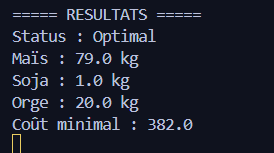
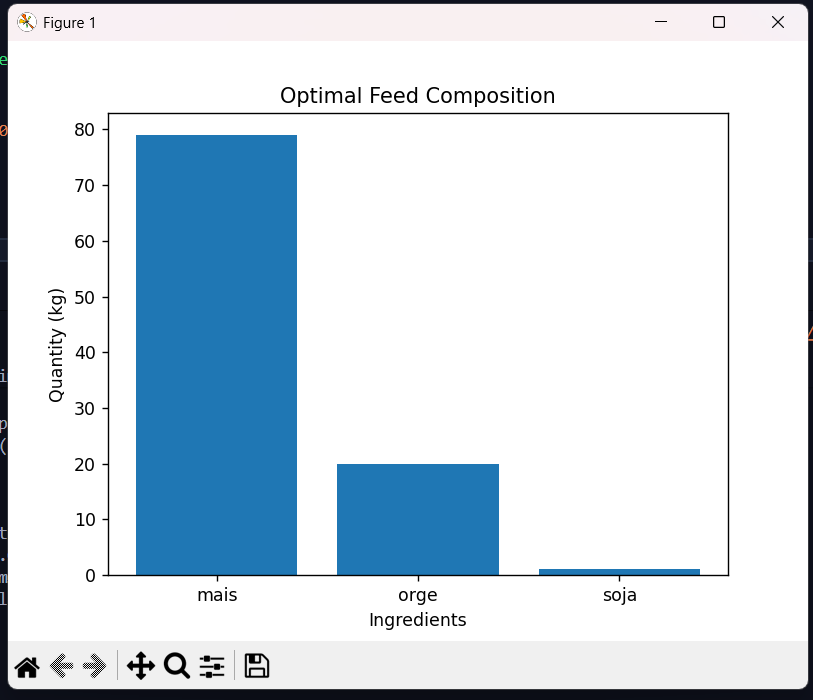
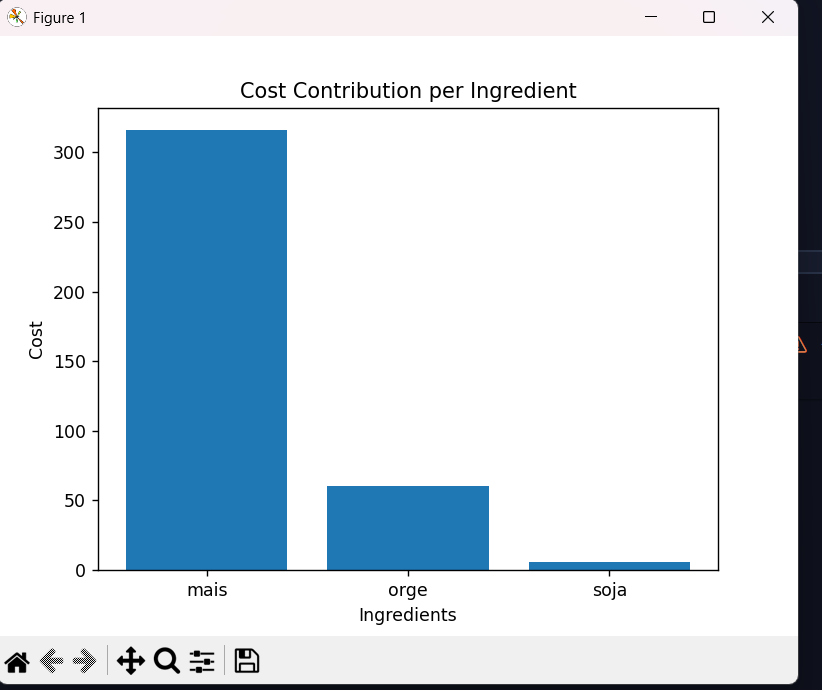
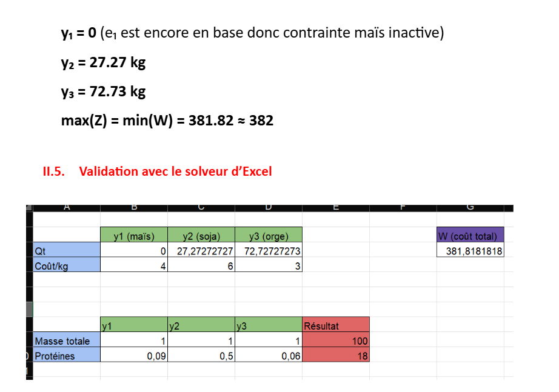

# Optimisation du mélange de nourriture pour animaux avec programmation linéaire

# Decription :

Ce projet est un programme Python qui résout un problème d’optimisation de ration alimentaire pour animaux (bovin, mouton, poulet) en utilisant la programmation linéaire avec la bibliothèque PuLP.

L’objectif est de déterminer la meilleure combinaison d’ingrédients (maïs, orge, soja, etc.) afin de :

Minimiser le coût total de l’alimentation 
Respecter les besoins nutritionnels (protéines, énergie, fibres) 

# Technologies utilisées

Python 3
PuLP (solveur linéaire CBC)
Matplotlib (visualisation des résultats)

# Visualisation

Le programme génère un graphique montrant :

Quantité de chaque ingrédient
Contribution au coût total

# Capture D'ecran

Ces captures d’écran illustre le résultat généré par notre programme, lequel est conforme et comparable à celui présenté dans le chapitre 2. Cette similitude permet de valider la cohérence du modèle implémenté ainsi que la correcte formulation des contraintes d’optimisation.

La différence observée dans l’image provient du fait que les contraintes de stock n’ont pas été respectées dans notre modèle. En conséquence, le solveur a pu produire une solution différente de celle attendue, car certaines limitations relatives aux quantités disponibles des ingrédients n’ont pas été correctement prises en compte. Cela a entraîné un écart entre la solution théorique et la solution obtenue.

    pour le mais : 90 kg
         l' orge : 20 kg
         le soja : 70 kg

Le solveur a attribué une quantité de 22 kg d’orge dans la solution optimale. Ce résultat s’explique par le respect des contraintes du modèle, notamment les limites de stock imposées pour chaque ingrédient ainsi que les exigences nutritionnelles définies. Ainsi, l’algorithme a déterminé une solution réalisable et cohérente, satisfaisant l’ensemble des contraintes tout en minimisant la fonction objectif (le coût total).

